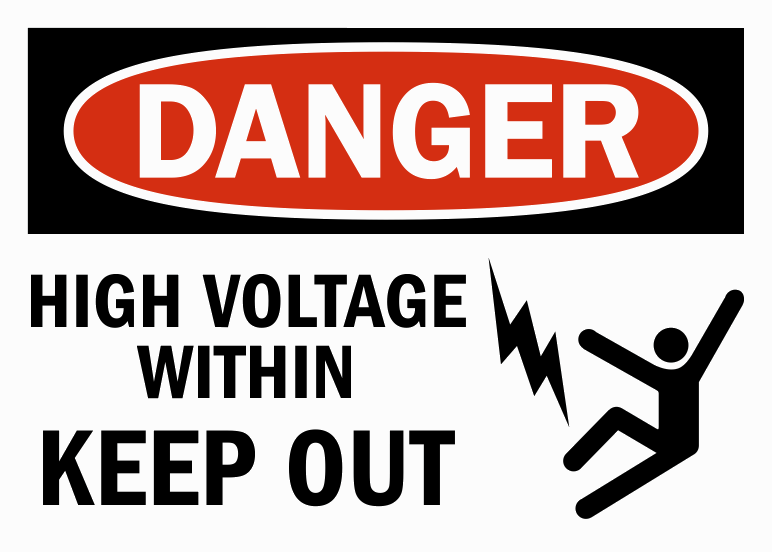

= Feature Spec
Luke San Antonio - Bialecki <lukesanantonio@gmail.com>

This spec lists (and explains) the features that need to be supported by the
engine for the game to be properly implemented. This document will also discuss
their implementation, when applicable.

== Overview

.Controls
* Left mouse button
** Used to shoot the grappling gun
* Action button
** Used to interact with the environment

=== Scripting

Lua

==== Events

.Built-in event handlers
* Modify the property of an entity (the entity that caused the interaction;
  fixed entity modification should be possible, but I'm not sure how that can be
  used).

=== Entities

==== Properties

Entities can have properties of some type, they must at least have a name that
will be used to reference them and may have bounds on the value that they hold
(min, max, etc).

The property set is sort of like the class of an entity.

.base-renderable properties
* Position / Orientation
* Render asset

==== Player

The player maintains health, and a battery count level. The charge of the
grappling gun is a property of the battery attached to the player's grappling gun.

==== Battery

Holds charge, rendered (can be clicked on to be picked up).

==== Battery Attachment

The battery that goes on the grappling gun. Purely semantic

A battery holds charge.

==== Fusebox

A fusebox stores a certain amount of constant charge, but that may change from
external factors. The grappling gun for example may exchange charge with the
fuse box.

==== Grappling Gun

The grappling gun owns a battery

=== Clickable Objects

* Unproject click
* Do a raytrace with bullet
* Dispatch an event (depending on the type of click)

=== Map Features

* Fuseboxes must modify other entities in the map, possibly changing their
position

The grappling gun will be used to activate certain fuseboxes, that must then
modify other entities after a given threshold. These actions should be packaged
and activated / deactivated as a unit. This could probably be most easily
implemented by attaching a script unit to each property to be notified when the
property is modified. Then again, this has to be a per-entity thing to be
useful. For example each fusebox will likely do something different. It should
be easier than writing a script for each routine. Ideally we find a way to
declaratively change an objects position and properties. Which would then
activate scripts (sort of reactively). If the listener of a property must have
behavior on a per-entity basis, a common listener should instead be used to
activate the script stored in the value of another property. See
fusebox-properties for an example.

=== Bubbles

Bubbles are areas in the map that activate a script, audio clip or other event.

=== Audio

.Uses
* A looping audio source coming from a fixed location
* A scripted audio clip activated when the user enters a bubble.
* Background music

.Features
* Play / Pause at any point in the audio clip
* Fade-in / Fade-out
* Looping (a segment, not necessarily the entire clip)
* Optionally positional
* Accessible from Lua code

=== Hud / GUI / Skinning

.Uses
* Display properties of the player and grappling gun for the user.
* Display the content of books
* Show the current mission (passively on the Player HUD and when a new mission
  is estalished).
* Display information or help

.Features
* Usable from json
* Mapping to entity properties (updated when the properties are changed)
* Not limited to properties
* Positioning relative to screen edges, other hud elements.
* On-the-fly font rendering

.Implementation
* The player HUD should be declared statically with JSON by mapping player
  properties to UI elements with positions.
* Books could be implemented as static entities with text content being a
  property. A skin for displaying the books could be plain JSON. The book skin
  could be overlayed / combined with the player HUD when neessary.
* When a new mission is established the player should be notified with text on
  the screen. This could just be a static JSON skin that references the current
  mission property but is only displayed when necessary and overlayed similar to
  the previous point.

.Future
* Interactive?

=== Scripting

.Features
* HUD
** Add and remove huds
* Entities
** Modify properties

.Future
* HUD
** Build a HUD dynamically

=== Level

.Missions
. Find the Library
. Find more information
. Find the grappling gun
. Find your way out (the main door)
. Find another way out (the cave)
. Explore the cave
. Turn on the power
. Venture further
. Defeat the enemy without setting off any alarms.

.Outline
. Batteries may be used to charge the Grappling Hook, which remains charged
until something drains that charge
. Magnets may be used to make the Grappling Hook magnetic, but the effects wear
off over time.
.. When we want to remove this mechanic, there are ways to demagnetize a
permanent magnet.
.. When we want to add it, just attach it to a very strong magnet.layer spawns crouched in a vent.
.. Sounds come from behind; the escape is discovered.
. The player must explore and notice the books on the floor, which will be
translated when the player puts their crosshair on the book for about a second.

.Engine room puzzle outline
. In the generator room, there is a blocked off area of the room that is
presumably for the electrical equipment. The player must first turn the power on
using the switch that is behind the block, but of course visible. The simplest
way to do this is to have a button for the user to press with the
grappling gun.
+
The blocked off area could have a graphic like this:
+

+
Optional: The generator begins starting up, but is interrupted by a failure
sound because a key or something was not inserted.

. Physical parts of the engine begin to glow to indicate their charge. The
player can shoot the grappling gun at the glowing parts and the grappling hook
will glow similarly, but as soon as the grappling gun is detached, it loses
charge. The player must hook the gun onto the uncharged fusebox and touch the
grappling gun to the glowing generator. Doing so will charge the fusebox and
open the door.

.Puzzle
. The player encounters a pool of water.
. Powering on the room starts a freezer that turns the water into ice.
. The player can now cross, or pull and push things across.

== Mechanics

. The grappling hook can not hold any charge alone, but can act as a wire.

. Batteries may be found charged or discharged. They may be charged through the
grappling gun's interaction with some other charged object.

. Magnets may be used to make the grappling hook magnetic, but the effects wear
off over time.
